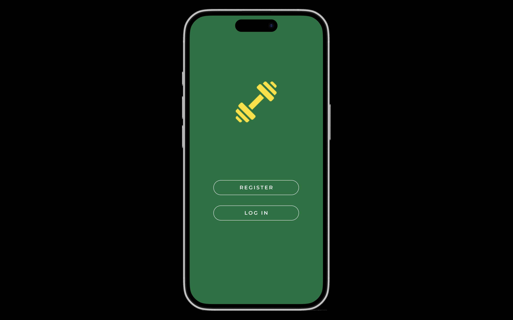
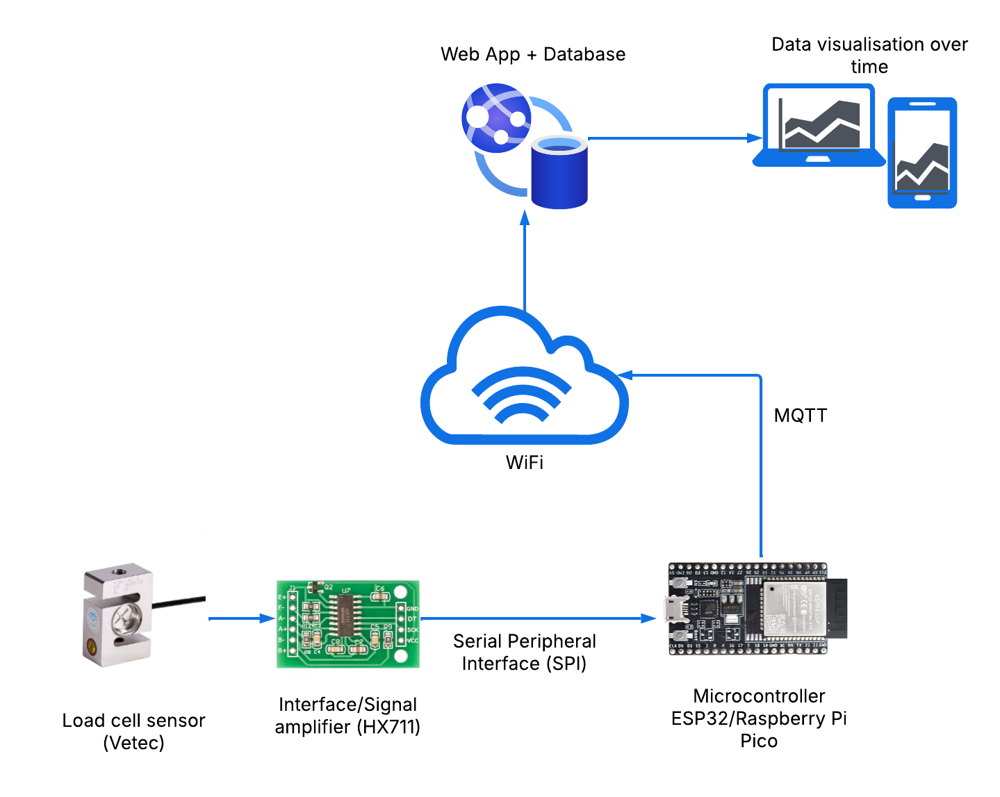

# IMTP Strength Measurement Mobile App

A comprehensive mobile application for measuring strength using the Isometric Mid-thigh Pull (IMTP) exercise. This project combines hardware sensors, microcontroller firmware, and a Flutter mobile application to capture, process, store, and visualize strength data.

## Project Overview

This project focuses on developing a mobile app for measuring strength using the Isometric Mid-thigh Pull (IMTP) exercise. A load cell sensor is used to capture the force exerted during the pull. This data is then processed by a microcontroller, transmitted wirelessly, stored securely in a database, and finally accessed and visualized by users through the mobile application.

## Application Home Page



## Test Selection Feature

The application now includes a comprehensive test selection system that allows users to choose between different types of strength tests. From the user profile screen, athletes or trainers can tap the "RUN TEST" button which navigates to a dedicated test selection screen:

### Available Tests

- **IMTP (Isometric Mid-thigh Pull)**: Measures maximal force production in the mid-thigh position
- **Iso squat**: Evaluates isometric strength in the squat position, useful for lower body assessment
- **Bench press**: Measures upper body pressing strength
- **Custom**: Allows for custom-configured testing protocols based on specific requirements

Each test option takes the user to the same dashboard interface but configures the system to record and display data specific to the selected test type. The test type is clearly displayed in the dashboard interface to ensure users know which protocol is being measured.


## Key Features

- **Real-time IoT Data Monitoring**: View sensor data from connected devices in real-time
- **Historical Data Analysis**: Visualize performance trends over time
- **Administrative Tools**: User management interface for coaches/administrators
- **MQTT Integration**: Reliable communication protocol for IoT devices
- **Wireless Communication (WiFi)**: The microcontroller transmits the processed data to the mobile app.
- **Multiple Test Types**: Support for various strength tests including IMTP, Iso squat, and Bench press
- **Consistent User Interface**: Unified dark theme with green accents throughout the application
- **Responsive Design**: Adapts to different screen sizes and orientations


## System Components

### Hardware Development

- **Load Cell Sensor (Vetec)**: Primary component for measuring the force applied during the IMTP.
- **Interface/Signal Amplifier (HX711)**: Interfaces with the load cell and amplifies its output signal, making it suitable for the microcontroller to read.
- **Microcontroller (ESP32)**: Central processing unit that receives the amplified signal, pre-processes the data, and handles wireless communication.
- **Serial Peripheral Interface (SPI)**: Communication protocol used for data transfer between the amplifier and the microcontroller.

Below is a basic diagram illustrating the load cell setup:



### Firmware Development

- **Load Cell Data Acquisition**: Programming the microcontroller to read data from the amplifier via SPI.
- **Data Pre-processing**: Implementing algorithms to process the raw load cell data (filtering, calibration).
- **Wireless Communication Implementation**: Developing firmware to establish a wireless connection and transmit data using MQTT.

### Server (Backend) Development

- **Database Management**: Securely storing strength data received from the microcontroller.
- **API Development**: Creating interfaces that allow the mobile application to access the data.
- **MQTT Broker**: Handling the incoming data stream from microcontrollers, especially if scaling to multiple users or devices.

### Mobile App Development

- **User Interface (UI) Design**: Creating an intuitive and user-friendly interface.
- **Data Visualization**: Implementing features to visualize strength data over time (graphs, charts).
- **User Authentication and Authorization**: Secure user accounts and login systems.
- **Data Retrieval and Display**: Fetching data from backend APIs and displaying it to users.

## IoT Integration

The app uses MQTT (Message Queuing Telemetry Transport) protocol for communicating with IoT devices. This lightweight protocol is ideal for constrained devices and low-bandwidth, high-latency networks, making it perfect for IoT applications.

### IoT Dashboard

The IoT Dashboard screen provides:
- Real-time temperature and humidity readings
- Historical data visualized through charts
- Connection status monitoring
- Device information display

The dashboard connects to an MQTT broker to receive sensor data. For demonstration purposes (as seen in the `temp-humidity-sensor` branch), it can subscribe to a topic like `data/1dv027` for temperature and humidity. In the future, this will be adapted to subscribe to the relevant MQTT topics for real-time IMTP sensor data.

## Project Structure

The project is organized into four main components:

```
idrott-app/
├── backend/                    # Python Flask server with WebSocket support
│   ├── app.py                 # Main Flask application
│   ├── Makefile               # Build and run commands
│   ├── requirements.txt       # Python dependencies
│   ├── venv/                  # Python virtual environment
│   └── templates/             # HTML templates
│
├── ESP32_PlatformIO_Project/   # ESP32 firmware for sensor data collection
│   ├── src/
│   │   └── main.cpp           # ESP32 firmware code
│   ├── platformio.ini         # PlatformIO configuration
│   └── README.md              # ESP32 setup instructions
│
├── flutter_app/               # Flutter mobile application
│   ├── lib/
│   │   ├── components/        # Reusable UI widgets (buttons, text fields, etc.)
│   │   │   ├── auth_card.dart
│   │   │   ├── back_button.dart
│   │   │   ├── custom_text_field.dart
│   │   │   ├── primary_button.dart
│   │   │   └── profile_icon.dart
│   │   │
│   │   ├── models/            # Data models
│   │   │   └── user.dart      # User model for authentication
│   │   │
│   │   ├── screens/           # UI screens
│   │   │   ├── auth/          # Authentication screens
│   │   │   │   ├── login_screen.dart
│   │   │   │   └── register_screen.dart
│   │   │   ├── admin/         # Admin management screens
│   │   │   │   ├── admin_dashboard.dart
│   │   │   │   ├── add_user_screen.dart
│   │   │   │   ├── settings_screen.dart
│   │   │   │   └── user_list_screen.dart
│   │   │   ├── add_user_screen.dart
│   │   │   ├── add_user_success_screen.dart
│   │   │   ├── auth_screen.dart
│   │   │   ├── backend_settings_screen.dart
│   │   │   ├── choose_test_screen.dart
│   │   │   ├── iot_dashboard.dart
│   │   │   ├── realtime_comparison_screen.dart
│   │   │   ├── user_profile_screen.dart
│   │   │   └── user_test_dashboard.dart
│   │   │
│   │   ├── services/          # Business logic and API services
│   │   │   ├── backend_config.dart      # Backend configuration
│   │   │   ├── loadcell_api_service.dart # REST API communication
│   │   │   ├── mqtt_service.dart        # MQTT client (legacy)
│   │   │   ├── users_data.dart          # User management
│   │   │   └── websocket_service.dart   # WebSocket communication
│   │   │
│   │   ├── theme/             # App styling and theming
│   │   │   ├── app_theme.dart
│   │   │   ├── colors.dart
│   │   │   └── text_styles.dart
│   │   │
│   │   └── main.dart          # App entry point
│   │
│   ├── android/               # Android-specific configuration
│   ├── ios/                   # iOS-specific configuration
│   ├── web/                   # Web platform support
│   ├── pubspec.yaml           # Flutter dependencies
│   └── README.md              # Flutter app documentation
│
└── README.md                  # Main project documentation
```

## Getting Started

### Prerequisites

- Flutter SDK (version 3.0.0 or higher)
- Dart SDK (version 2.17.0 or higher)
- Android Studio or Xcode for mobile device emulation/testing
- Physical Android or iOS device for testing
- ESP32 microcontroller (for hardware integration)

### Device Setup

For detailed instructions on running the app on physical devices or simulators, see **[DEVICE_SETUP.md](DEVICE_SETUP.md)**.

The device setup guide covers:
- iOS Simulator setup
- Android and iPhone physical device connection (USB and wireless)
- iOS code signing setup (see **[IOS_CODE_SIGNING.md](IOS_CODE_SIGNING.md)** for detailed guide)
- Troubleshooting common connection issues

### Running the App

1. Navigate to the project directory
   ```
   cd idrott_app
   ```

2. Clean the project (recommended when switching branches or when facing build issues)
   ```
   flutter clean
   ```

3. Get dependencies
   ```
   flutter pub get
   ```

4. Run the app
   ```
   flutter run
   ```
   
   To run on a specific device:
   ```
   flutter devices  # List available devices
   flutter run -d <device_id>  # Run on specific device
   ```

For troubleshooting device connection issues, see the **[Device Setup Guide](DEVICE_SETUP.md#troubleshooting)**.

## Testing ESP32-Backend Connection

When developing or testing the ESP32 sensor integration with the backend, you'll need to run both components simultaneously to verify data transmission and WebSocket communication.

### Two-Terminal Workflow

To test the complete ESP32-to-backend data flow:

**Terminal 1 - ESP32 Development:**
```bash
cd ESP32_PlatformIO_Project
pio run -t upload -t monitor
```
This will:
- Compile and upload the firmware to your ESP32
- Start monitoring the serial output to see connection status and sensor data

**Terminal 2 - Backend Server:**
```bash
cd backend
make run
```
This will:
- Start the Flask backend server with WebSocket support
- Listen for ESP32 connections on the configured port
- Enable the REST API for Flutter app communication

### What to Expect

1. **ESP32 Terminal**: You'll see WiFi connection status, WebSocket connection attempts, and real-time sensor readings
2. **Backend Terminal**: You'll see incoming WebSocket connections, ESP32 registration messages, and data reception logs
3. **Successful Connection**: ESP32 will show "WebSocket connected" and backend will show "ESP32 device registered"

### Troubleshooting Connection Issues

- Ensure both ESP32 and computer are on the same WiFi network
- Check that the ESP32 firmware has the correct backend IP address configured
- Verify the backend server is running and accessible on the network
- Monitor both terminal outputs for error messages

This workflow is essential when:
- Testing new ESP32 firmware updates
- Debugging sensor data transmission
- Verifying WebSocket communication protocols
- Developing new backend features that interact with ESP32

### Setting Up a Development Environment in Cursor

1. Open the project in Cursor
2. Use the integrated terminal to run Flutter commands
3. Edit code in Cursor's editor
4. Debug and run the application directly from Cursor
5. No need for Android Studio for Flutter development

## Mobile-Specific Considerations

- **Local Storage**: Mobile-optimized data storage for offline functionality
- **Mobile UI/UX**: Interface designed specifically for handheld touch devices
- **Native Look and Feel**: Following Material Design (Android) and Cupertino (iOS) design guidelines

## Development Roadmap

- [ ] Complete hardware integration with ESP32 and load cell
- [ ] Implement MQTT communication between hardware and mobile app
- [ ] Develop data visualization features
- [ ] Implement user authentication and profiles
- [ ] Add data export functionality
- [ ] Create administrative features for managing multiple users
- [ ] Implement real-time data streaming

## Resources

For help getting started with Flutter development, view the
[online documentation](https://docs.flutter.dev/), which offers tutorials,
samples, guidance on mobile development, and a full API reference.

For ESP32 development, refer to [ESP32 documentation](https://docs.espressif.com/projects/esp-idf/en/latest/).

For detailed device setup instructions, see **[DEVICE_SETUP.md](DEVICE_SETUP.md)**.
